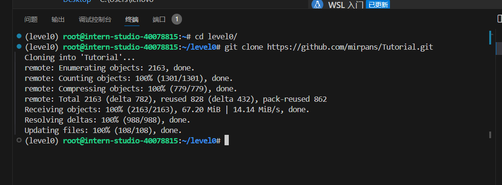
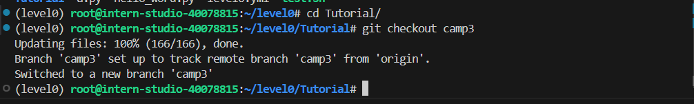
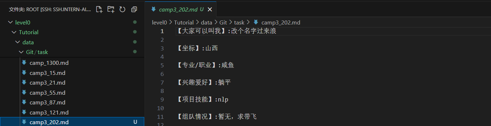
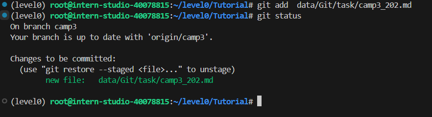
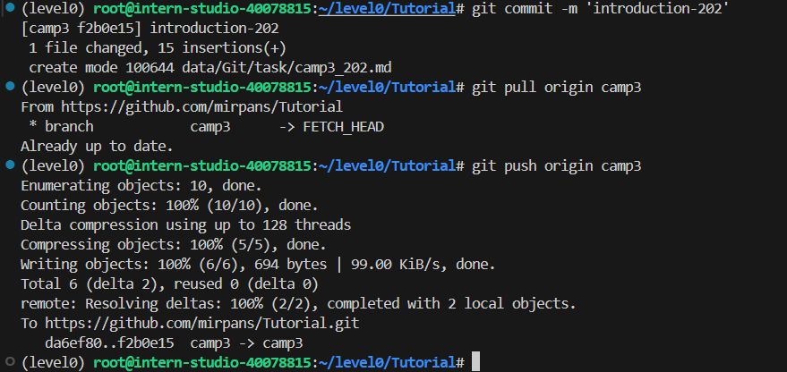
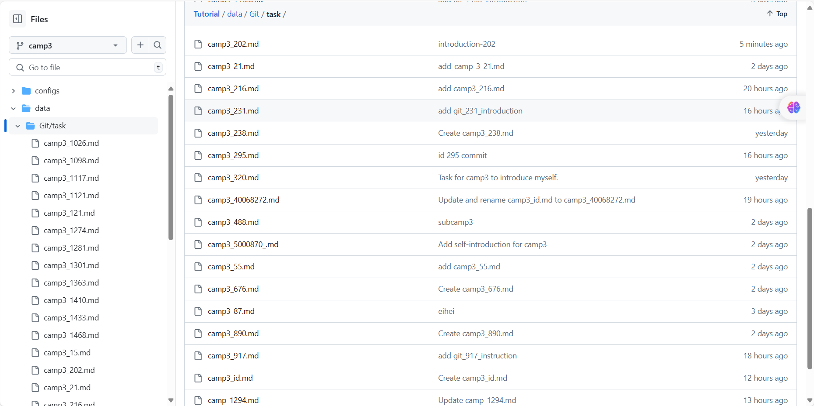
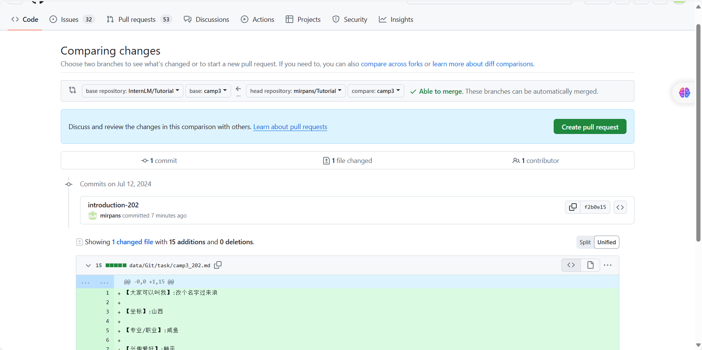
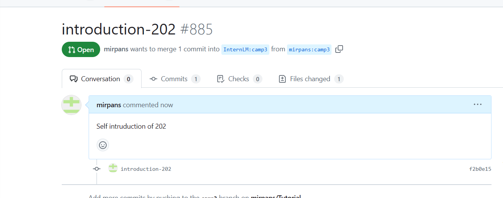

## 破冰活动自我介绍

#### 要求

1. 命名格式为 `camp3_<id>.md`，其中 `<id>` 是您的报名问卷ID。
2. 文件路径应为 `./data/Git/task/`。
3. 【大家可以叫我】内容可以是 GitHub 昵称、微信昵称或其他网名。
4. 在 GitHub 上创建一个 Pull Request，提供对应的 PR 链接。

#### 过程

先fork一个项目到自己的远程仓库：

克隆到本地：

切换到对应分支camp3：

 在./data/Git/task/目录中新建文件camp3_202

将改动添加到本地仓库：

提交并上传到远程仓库(首次需要设置email和name)：

可以看到自己的远程仓库已经新增了文件camp3_202:

创建拉取请求：

提交拉取请求：

## 创建实践项目

暂时没有项目，以后补上