## 0.完成SSH连接与端口映射并运行hello_world.py

#### 使用powershell进行ssh远程连接

使用以下命令生成密钥：

```
ssh-keygen -t rsa
```

查看公钥

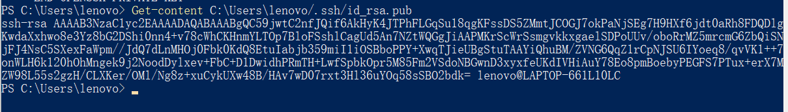

配置公钥

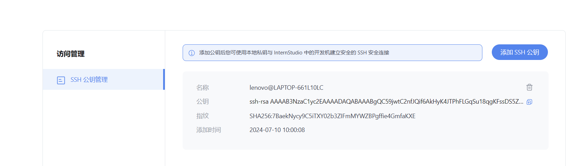

进入开发机平台，进入开发机页面找到我们创建的开发机，点击SSH连接，复制命令。

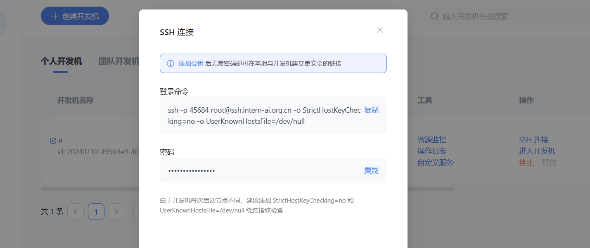

使用powershell成功连接：

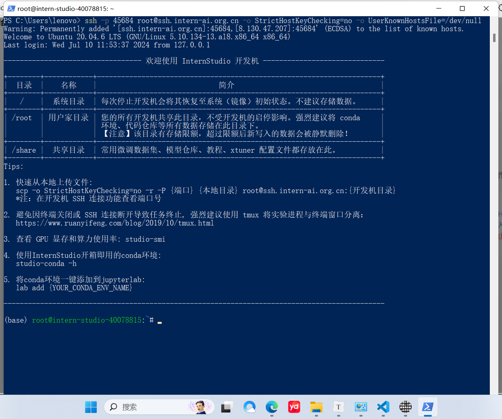

#### 使用VSCODE连接

安装ssh插件：

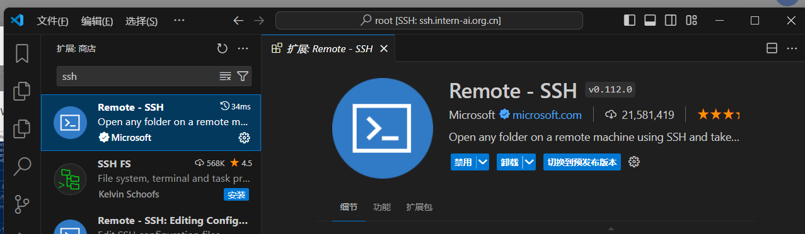

安装完成插件以后，点击侧边栏的远程连接图标，在SSH中点击“+”按钮，添加开发机SSH连接的登录命令。

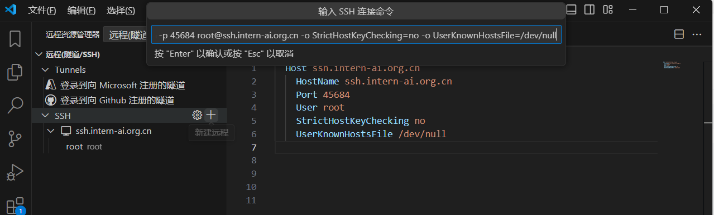

使用vscode成功连接：

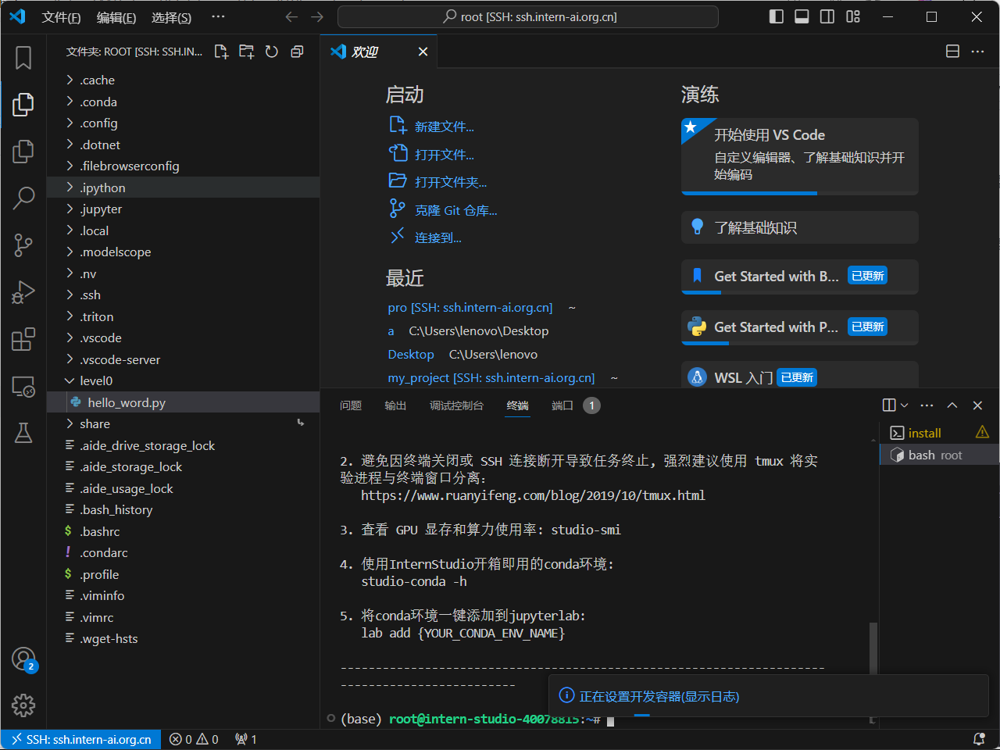

#### 端口映射与helloworld

###### 命令行端口映射

首先运行helloworld.py:

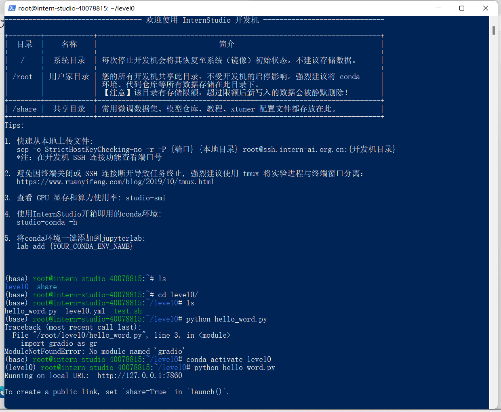

另起一个命令行窗口添加端口映射


打开浏览器访问127.0.0.1:7860成功访问

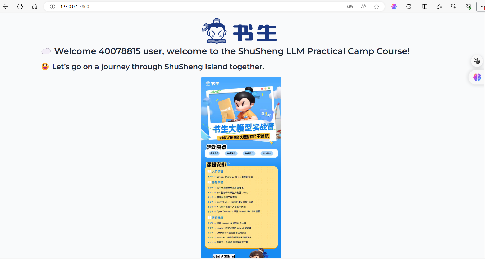

###### vscode端口映射：

vscode使用ssh连接远程运行helloworld.py会自动进行端口映射无需手动配置：

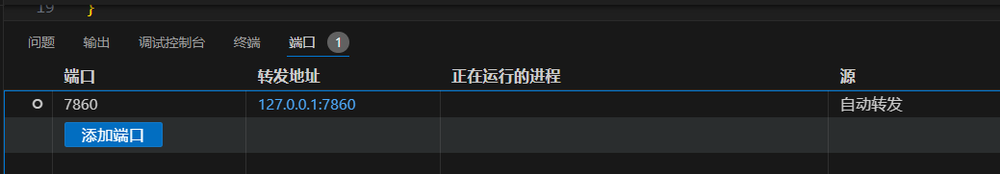


## 2.创建一个conda环境

使用以下命令创建环境

```
conda create -n level0 python=3.11.7
```

查看并激活环境：

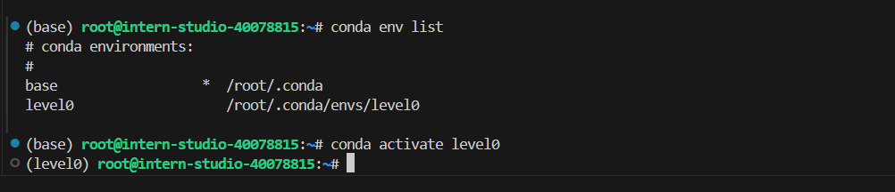

## 3.创建并运行`test.sh`文件

事先导出环境配置并删除环境level0

```
conda env export --name level0 > level0.yml
#导出环境配置
conda remove -n level0 --all
#删除环境
```

level0.yml文件：

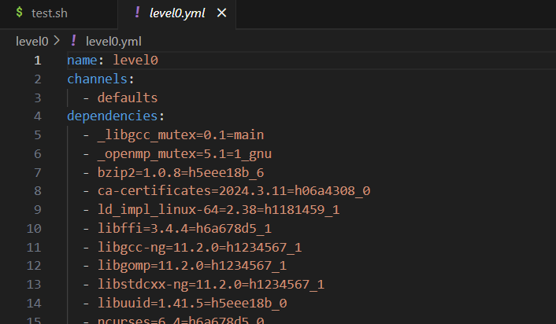

目前环境中没有level0

执行以下命令恢复环境level0

```
cd 对应路径
./test.sh restore level0
```

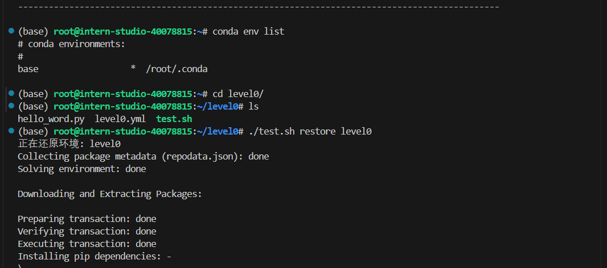

成功恢复环境：

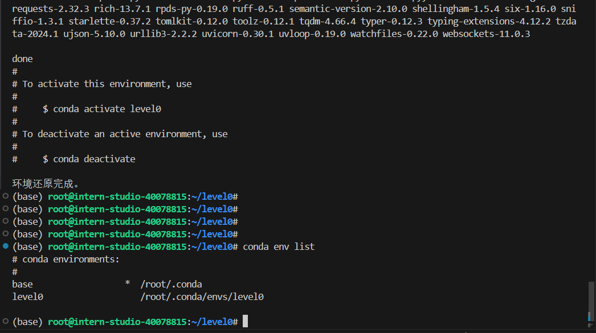