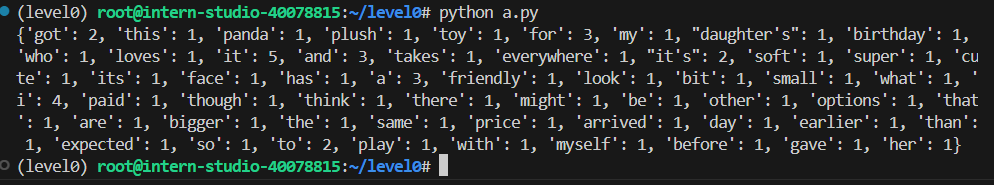

## Python实现wordcount

```
def wordcount(mystr:str):
    mystr =mystr.lower()

    translator = str.maketrans('?,!.','    ')
    mystr = mystr.translate(translator)
    mylist = mystr.split()

    mydict={}
    for word in mylist:
        if mydict.get(word):
            mydict[word]+=1
        else:
            mydict[word]=1
    return mydict
```

## Vscode连接InternStudio debug笔记

使用源码a.py

配置一个解释器


打好断点，点击运行->启动调试，开始进行调试


可以在launch.json里配置调试细节（具体怎么设置用到了再查）：


得到最终运行结果：

